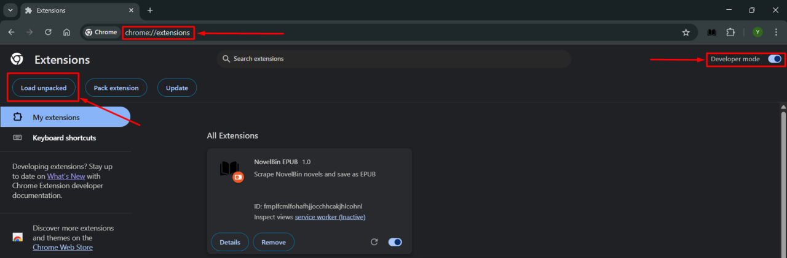
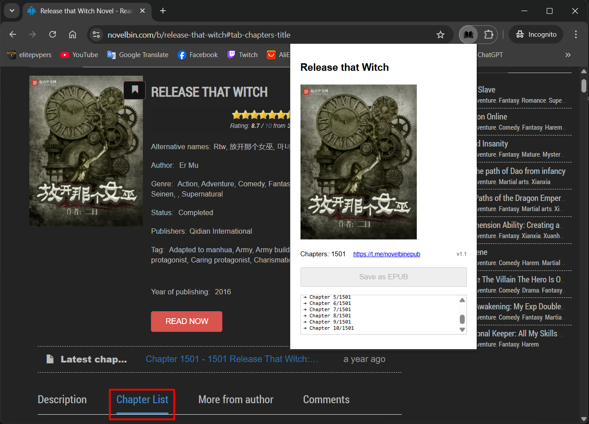

Chrome extension to download novel from site [novelbin.com](https://novelbin.com) [or mirror [novelbin.me](https://novelbin.me)] as epub file.\
[Telegram group](https://t.me/novelbinepub)

# How to load extension in chrome
1) Download latest release
2) Extract .zip file
3) Go to Chrome extensions: chrome://extensions/
4) Enable "Developer mode" (top right corner)
5) Press "Load unpacked" (top left) and select extracted folder from step (2)

# Usage
After extension successfully installed go to **novelbin** novel page, and open Chapter List. 
Next, open installed extension from extension shortcut panel and hit "Save as EPUB". 
Wait until all chapters downloaded before getting promt to save file.

> [!WARNING]
> Do not close extension window while downloading or process will be aborted.
