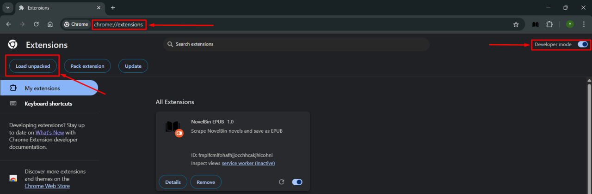
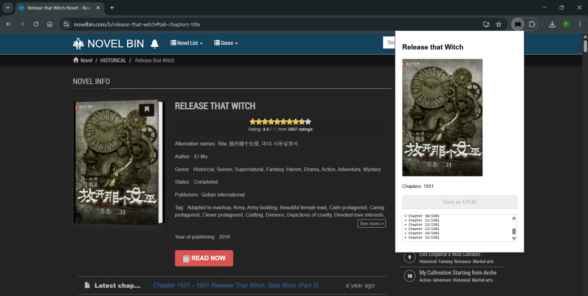

Chrome extension to download novel from site novelbin.com as epub file.
1) Download included files as ZIP
2) Extract .zip file
3) Go to Chrome extensions: chrome://extensions/
4) Enable "Developer mode" (top right corner)
5) Press "Load unpacked" (top left) and select extracted folder from step (2)

After extension successfully installed go to novelbin.com novel page, and open Chapter List. 
Next, open installed extension from extension shortcut panel and hit "Save as EPUB". 
Wait until all chapters downloaded before getting promt to save file.

WARNING: Do not close extension window while downloading or process will be aborted.
